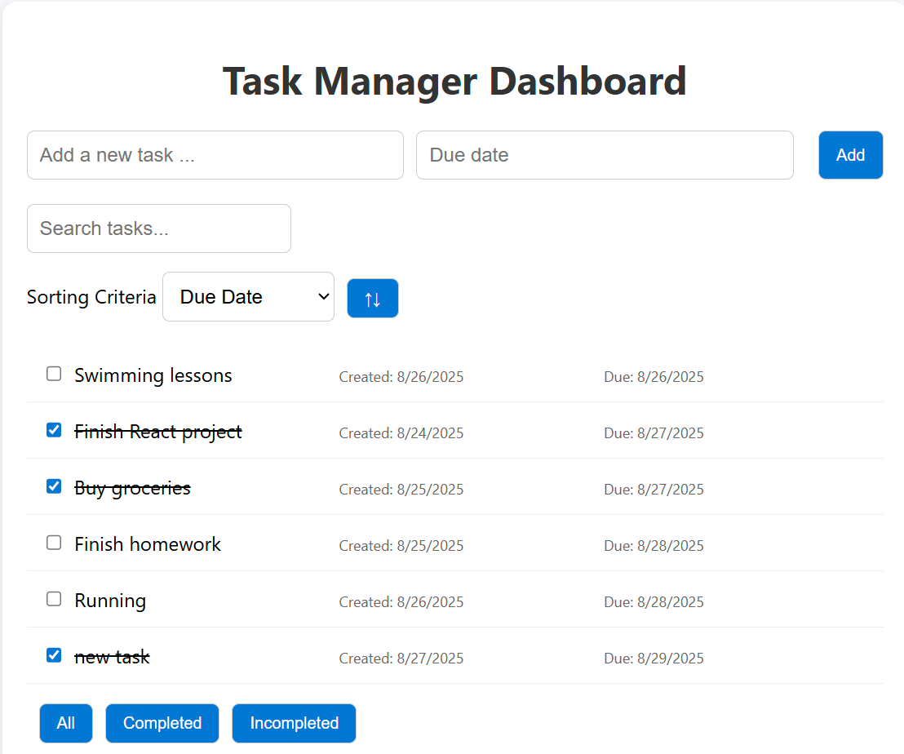

# Installation instruction

## Prerequisites

- Install NodeJS (>= v.23.11.0)
- Install node package manager - npm (>= v.10.9.2)
- Optional, install Docker Desktop and Git Bash

## Run Application

There are 2 choices:

- With Docker Desktop, execute the following command in your Git Bash

```bash
./runDocker.sh
```

- With npm, please do the following to run application

This project was bootstrapped with [Create React App](https://github.com/facebook/create-react-app).

## Available Scripts

In the project directory, you can run:

### `npm run start`

Runs the app in the development mode.\
Open [http://localhost:3000](http://localhost:3000) to view it in your browser.

The page will reload when you make changes.\
You may also see any lint errors in the console.

# Application clarification

- Create a task:
  - A task required title input. It can not be blank
  - By default, due date will be today if not selected
- Search a task:
  - A search bar to filter tasks by title (case-insensitive)
- Update status
  - Checkbox to indicate if task is completed (crossed out)
- Filters:
  - Buttons to be clcked to filter tasks: All, Completed, Incomplete.
  - By default, all tasks will be shown.
- Sorting:
  - By default, tasks will be sorted by Creation Date, ascending order
  - Choose from a value (either sort by Creation Date or Due date not both) and click "↑↓" button to change ascending order or descending order

# Application Demo

- Create a new task 
- Complete a task
- Search a task
- Fitler task
  - Complete
  - Incomplete
  - All
- Sorting
  - Due date
    - Ascending 
    - Descending
  - Creation date
    - Ascending
    - Descending 
